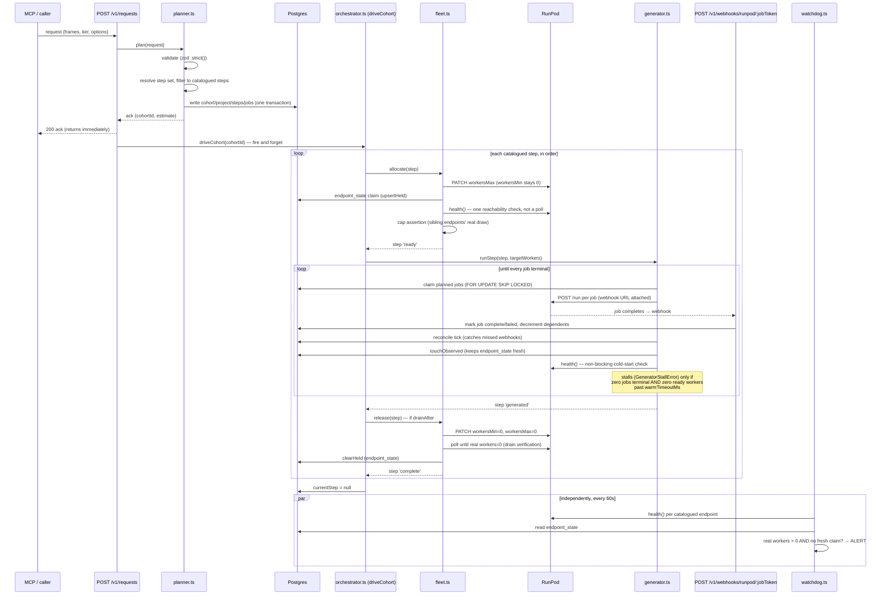

# QM Orchestrator — current agent flow

**Status as of 2026-09-10.** Describes what's actually built and running (M0–M3),
not the full 13-step spec design. Milestones referenced below: see
`docs/qm-orchestrator-implementation-plan.md` §13 for the build order this reflects.

## The agents

Four agents plus one standalone watchdog process, all in `orchestrator/src/`:

| Agent | File | Runs | Job |
|---|---|---|---|
| Planner | `agents/planner.ts` | Synchronously inside `POST /v1/requests` | Validates the request, resolves which steps apply, writes the plan to Postgres |
| Driver | `agents/orchestrator.ts` (`driveCohort`) | Fire-and-forget after the request ack | Sequences a cohort's steps in order: allocate → generate → release → next |
| Fleet controller | `agents/fleet.ts` (`allocate`/`release`) | Called by the driver, once per step | Only component allowed to change a RunPod endpoint's worker count |
| Generator | `agents/generator.ts` (`runStep`) | Called by the driver, once per step | Submits jobs to RunPod, tracks them to completion via webhooks |
| Watchdog | `watchdog.ts` (separate process/container) | Independently, every 60s | Catches orphaned RunPod workers a crashed orchestrator left billing |

Today only 3 of the spec's 13 steps are wired up (`steps/catalog.ts`): **1 (image,
qwen-image-gen), 2 (tts, flux-tts-s2t), 3 (animation, wan2-i2v)**. No quality gates yet
(M4), no result assembly or Convex callback yet (M5), no window scheduler (M6).

## The flow, start to finish

## Step by step, in prose

1. **Request in.** A caller (MCP) POSTs the full JSON payload to
   `POST /v1/requests` (`http/routes/requests.ts`), bearer-authed against
   `ORCH_INGEST_TOKEN`.
2. **Planner validates and plans**, synchronously, before the request is
   acknowledged — a malformed request fails fast, not six hours later. It:
   - Validates against a strict zod schema (unknown fields reject).
   - Resolves the *full* 13-step topology the request's tier/options imply, then
     filters to only steps present in `steps/catalog.ts` (today: 1–3). This is
     deliberate — it's what lets the catalogued subset run today without a
     test-only flag, and means adding steps 4–13 later needs only new catalog
     entries, not a planner change.
   - Expands each frame into one job row per (frame, step), with `deps_remaining`
     precomputed from the step's `dependsOn`.
   - Writes cohort/project/steps/jobs in one transaction, opening or reusing a
     cohort inline (windowId formula) — the real tumbling-window scheduler is M6;
     today `cohorts_one_running` just means only one cohort can be `running`
     account-wide, and nothing yet promotes a `queued` one when the running one
     finishes (a real gap — see "What doesn't close yet" below).
   - Returns an acknowledgement (cohort id, job count, a time estimate) immediately.
3. **The driver takes over in the background**
   (`agents/orchestrator.ts`'s `driveCohort`), sequencing the cohort's catalogued
   steps strictly one at a time, in `seq` order: allocate → generate → release (if
   `drainAfter`) → next step.
4. **Fleet controller allocates.** For each step, `allocate()`:
   - PATCHes the endpoint's `workersMax` only — `workersMin` never leaves 0,
     anywhere, as of the 2026-09-10 fix (see below for why).
   - Writes a claim to `endpoint_state` (Postgres) right after the PATCH — this is
     what the watchdog checks against RunPod's real state; it's a Postgres-only
     stand-in for the spec's DynamoDB lease design, which turned out unnecessary
     since MCP traffic never touches the AWS live-path provisioner.
   - Does one cheap `health()` reachability check (not a poll) and the existing
     account-cap assertion, then marks the step `'ready'` — no wait for real
     workers to actually warm up.
5. **Generator submits and tracks work.** `runStep()` claims planned jobs (up to
   the step's target worker count) and POSTs each to RunPod's `/run` with a
   per-job webhook URL attached. RunPod queues the job regardless of current real
   worker count and scales itself up via its own `QUEUE_DELAY` autoscaler as
   demand appears. Completion normally arrives via the webhook
   (`POST /v1/webhooks/runpod/:jobToken`, HMAC-verified, idempotent on
   `webhook_receipts`); a 60-second reconcile tick is the fallback for a missed or
   delayed one. `runStep()` also runs a **non-blocking cold-start check** each
   loop iteration — if the endpoint has never shown a real ready worker *and* no
   job has reached terminal within `warmTimeoutMs`, it raises a `GeneratorStallError`.
   This replaced a blocking pre-verification step in `allocate()` after a real
   2026-09-10 incident: forcing `workersMin` up to pre-warm workers billed 5
   active workers for 8+ minutes with zero throughput when they got stuck
   mid-cold-start. The new design costs nothing while waiting, because nothing is
   forced active until a real job is actually queued against it.
6. **Fleet controller releases**, once every job in the step is terminal and
   `drainAfter` is true (the endpoint-affinity rule — consecutive steps on the
   same endpoint stay warm between them instead of draining and re-scaling).
   PATCHes both counts to 0, polls until RunPod confirms zero real workers
   (this side is unchanged — a stuck drain is a real, actively-alerted cost
   risk, "$19/window" per the design doc), then clears the `endpoint_state` claim.
7. **Repeat** for the next catalogued step, until all are done, then the driver
   clears the cohort's `currentStep`.
8. **Watchdog, independently, the whole time.** A separate process (own
   container, own Postgres pool, own RunPod client — deliberately not sharing
   anything with the main orchestrator process, since surviving *that* process's
   death is the entire point) ticks every 60s: for each catalogued endpoint, if
   RunPod reports real workers but `endpoint_state` shows no fresh claim, it's an
   orphan — alert (loud log + optional webhook), and optionally auto-drain after
   a grace period if `WATCHDOG_AUTODRAIN=true` (off by default).

## How "the loop" closes — and where it doesn't, yet

**What actually closes today:** each **step** closes cleanly — `pending` →
`scaling` → `ready` → `running` → `generated` → (`draining` →) `complete`, with
every transition written to Postgres and (for the RunPod-facing ones)
independently verifiable via `GET /v1/fleet` or `endpoint_state`. A **cohort**
closes at the step-sequence level too — the driver runs every catalogued step in
order and stops.

**What does *not* close yet — real, known gaps, not oversights:**
- **The cohort row itself is never marked `completed`.** The driver clears
  `currentStep` to `null` but nothing transitions `cohorts.status` from
  `running`. This bit twice this session already — a finished cohort blocked a
  new one from opening (`cohorts_one_running`), requiring a manual
  `UPDATE cohorts SET status='completed'`. Real fix lands with M6 (result
  assembly / cohort mechanics).
- **No result assembly or Convex callback.** Nothing tells the original caller
  the project is done, or hands back asset URLs — that's M5's `result/assemble.ts`
  and `callback.ts`.
- **No quality gates.** Every job that reaches `complete` is taken at face
  value; a bad generation isn't caught or reworked — that's M4.
- **No queue-behind.** If a second request arrives while a cohort is `running`,
  it's rejected outright rather than queued for the next window — that's M6.
- **A permanently-stuck job is possible today**, if a job's upstream dependency
  *fails* (not completes): `deps_remaining` is only decremented on success, and
  there's no rework path yet, so that frame's downstream job sits at
  `status='planned', deps_remaining>0` forever, and its step's generator loop
  can never see `terminal >= total`. Known, not yet fixed (M4's rework path is
  the real fix); `runStep()`'s stall check is deliberately guarded (`terminal
  === 0`) so it doesn't misfire on this case.

So: the mechanism proves out end to end for image → tts → animation, driven
entirely by real Postgres state transitions and real RunPod calls — but "the
loop" in the full product sense (request → finished, delivered asset) doesn't
fully close until M5/M6 land.
