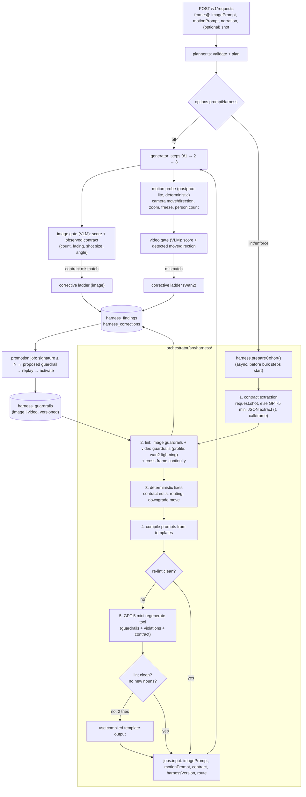

# QM Orchestrator — Prompt Harness & Guardrails: Implementation Plan

**Date:** 2026-09-15
**Status:** Proposed. Nothing in this doc is built yet.
**Scope:** the orchestrator background path (`orchestrator/`). Covers image steps 0/1 (Qwen-Image-Edit / Qwen-Image, with a Flux-4B fallback) and animation step 3 (Wan 2.2 I2V-A14B, 4-step Lightning).
**Replaces:** the per-failure LLM rework prompts in `src/quality/rewrite.ts` and the `(avoid: …)` correction in `src/agents/quality.ts`.
**Related:** `qm-orchestrator-implementation-plan.md` §6.5/§6.6 (quality gate, rule store), migration `004_rules.sql`, which was never wired up.

---

## 0. Summary

We keep paying for QA and rework because the prompts reach the models unchecked. In the Maya cohort (`win_2026_09_15_06`, 36 frames), **every** failure could have been predicted from the prompt text before any GPU time was spent (§1). This plan builds a **prompt harness** that sits between the request and the generators:

1. **Shot contract.** Each frame gets structured data: who is in frame and how many, which way they face, which way they move in screen space, shot size, camera angle, one camera move, and motion level.
2. **Guardrails.** Versioned rules, with **separate sets for image and video**. Each rule has a deterministic detector, a severity, and a corrective measure.
3. **Lint + compile.** Deterministic checks. Many violations are fixed by deterministic contract edits and re-compiling the prompt from a model-specific template.
4. **GPT-5 mini as the rewrite tool.** When a violation can't be fixed deterministically, `openai/gpt-5-mini` (Replicate, already configured as `REPLICATE_REWRITE_MODEL`) regenerates the prompt. It gets the active guardrails and the violations as input. Its output must pass the same lint, or we fall back to the compiled template.
5. **Wan2 Lightning motion harness.**
   - A capability profile of the moves the 4-step model can actually execute.
   - A **direction and camera-angle lock** that runs from plan time through the source image to the finished clip.
   - A deterministic **motion probe** (optical flow) that checks the clip against the contract.
   - A corrective ladder keyed on the mismatch type.
6. **Findings → corrective measures → guardrail updates.** Every lint hit, rewrite, QA verdict and probe result is stored with the measure we applied and its outcome. Signatures that recur get proposed as new guardrails. We replay each proposal against past prompts before activating it.

Rollout is `options.promptHarness: 'off' | 'lint' | 'enforce'`. The default is `lint` until the Maya re-run acceptance test (§13) passes.

---

## 1. Evidence: the Maya cohort

Real data from the VPS (`quality_verdicts` joined to `jobs`, cohort `win_2026_09_15_06`). Per-frame verdicts are listed in order: first attempt, then reworks.

| Frame | Prompt (as sent) | Verdicts | Actual defect | Predictable from prompt? |
|---|---|---|---|---|
| f12 image | "…the crystal glowing softly beside her… staring at the wall" | FAIL 5.35 > 6.25 > 6.63 | 2 identical girls, then 3 crystals | Yes. Uncounted noun; facing a wall (possible reflection/duplication). |
| f13 image | "pressing her palm flat against a closed wooden door, her fingers sinking into the wood" | FAIL 5.75 > 6.23 > 4.95 | Duplicated right hand, extra arm from off-screen | Yes. Hand-contact close-up on Qwen. The rework made it worse. |
| f18 motion | "tracking shot behind her as she walks down the subway stairs" | FAIL 4.55 > 4.75 > PASS 5.40 | Static camera, and she walks **up the stairs toward the camera**: action and camera side both reversed | Yes. The source image shows her from the front, but the prompt asks for a view from behind. I2V can't move the camera to the other side of the subject. |
| f19 motion | "slow push in on her facing the glowing wall" | FAIL 2.85 > 3.58 > 2.60 | A stranger walks in from frame right | Yes. The public platform wasn't declared empty, and the camera move reveals frame edges. |
| f20 motion | "she steps into the rippling tiles and disappears into the light" | FAIL 3.10 > 2.70 > 3.90 | Limbs warp, stretch, multiply | Yes. A state transformation ("disappears") in a 4-step model. |
| f21 motion | "slow crane up revealing the enormous hidden station above her" | FAIL 4.80 > 4.70 > 4.70 | Completely static | Yes. Crane/pedestal isn't executable on Lightning, and "revealing" needs content that isn't in the frame. |
| f23 motion | "camera tilts down following the spiral staircase into the depths" | FAIL 4.10 > 4.10 > 2.15 | Legs and backpack warp | Yes. A compound move (tilt plus follow) with a walking subject on stairs. |
| f01/f22 motion | "slow tracking shot following her…" / "tracking shot as she walks past…" | PASS 5.10 / PASS 5.00 | Borderline, just over the pass bar | Yes. Tracking is marginal on Lightning. |

Counter-evidence that shapes the rules (§5.2, rule V-ACT-02):
- **Pass-through shots passed when the source image already showed the character half-merged with the wall** and the motion was small: f09 7.95, f11 7.05, f15 6.60, f36 7.05.
- f20 failed because it asked for a **disappearance**, which is a state change, not a small continuation.

Two more lessons from the same run:
- The `(avoid: <defect>)` suffix put the defect's own nouns into the positive prompt. f18/f19/f20 prompts grew two stacked `(avoid: …)` clauses. The QA model then graded against them ("directly violates the negative prompt").
- The GPT-5 mini rewrites (`rewrite.ts`) stated fixes positively but **invented detail** ("fingertips sinking 5–8 mm"). Movie Gen reports the same effect (§2).

Earlier findings that constrain the design:
- **Step count and negative prompts are not the lever** (`qm-video-conformity-prompt-testing`). Steps 4/8/12 showed no quality trend. `negative_prompt` had no measurable effect. LightX2V-style structured prompts made motion *more conservative*, not less adherent.
- **The i2v model inherits what the source frame lacks** (the missing-kitten incident). A subject that is described in motion but absent from the image gets hallucinated limbs. The fix belongs in the image prompt.
- **Lightning runs at cfg 1.0**: guidance is distilled out, so prompt adherence is structurally weak (`qm-orchestrator-wan2-cfg-rungs`). The harness has to ask only for what the model can do unguided.

---

## 2. Movie Gen: what transfers to Wan2 Lightning

Source: *Movie Gen: A Cast of Media Foundation Models* (Meta, 2024), https://ai.meta.com/static-resource/movie-gen-research-paper, §3.2.1 captioning, §3.3 SFT captions, §3.4.1 inference prompt rewrite, §3.5 evaluation, Appendix B.2 camera motion types, §8 limitations.

### 2.1 What the paper does

- **Standardized information architecture for prompts** (§3.4.1). A LLaMa3 rewriter turns short user prompts into dense captions with "a standardized information architecture… ensuring consistency in the visual composition". Training captions average ~100 words.
- **Simple vocabulary** (§3.4.1). The rewriter "replac[es] complex vocabulary with more accessible and straightforward terminology."
- **Too much motion detail causes artifacts** (§3.4.1): "excessively elaborate descriptions of motion details can result in the introduction of artifacts in the generated videos, highlighting the importance of striking a balance between descriptive richness and visual fidelity."
- **Camera control is a label prefixed to the caption** (§3.2.1, App. B.2). A classifier predicts one of **16 camera motions** and the label is prefixed to the training caption: zoom in, zoom out, push in, pull out, pan right, pan left, truck right, truck left, tilt up, tilt down, pedestal up, pedestal down, arc shot, tracking shot, static shot, handheld shot. SFT adds **6 camera position types**: wide angle, close-up, aerial, low angle, over the shoulder, first person view.
- **Required caption content** (§3.3). Human-refined SFT captions must cover camera control, human expressions, subject and background, detailed motion description, and lighting.
- **Training data filtering** (§3.2.1). They filtered out jittery camera motion, slideshow-like clips and static clips, and scored motion with FFmpeg motion vectors and Farnebäck optical flow.
- **Evaluation axes** (§3.5.1):
  - Text alignment, split into **subject match** (appearance, background, lighting, style) and **motion match**.
  - Visual quality, split into **frame consistency** (morphing, objects appearing or disappearing), **motion completeness** (enough motion), and **motion naturalness** (limbs, physics).
  - Realness and aesthetics.
- **Hard categories and known failures** (§3.5.2, §8):
  - Prompts are tagged by motion level (low/medium/high).
  - Unusual activities ("people flying") tend to yield **static videos or camera-only motion**.
  - Artifacts cluster around "complex geometry, manipulation of objects, object physics, state transformations."
- **Rewriter distillation** (§3.4.1). They distilled the 70B rewriter into an 8B model, fine-tuned on **human-approved rewrite pairs**.

### 2.2 Verdict: can we build good Wan2 Lightning prompts from this?

**Yes for structure, vocabulary, taxonomy, risk tagging and evaluation. No for treating it as a control guarantee.**

**Adopt:**

| Movie Gen practice | How the harness uses it |
|---|---|
| Standardized information architecture | Deterministic per-model templates (§6.3). The prompt always leads with the camera move, then shot size and angle, then subject, action and direction. |
| Camera motion label prefixed to the caption | The contract's `camera.move` enum uses the 16 Movie Gen classes plus the 6 position types. The compiled prompt always **starts** with the move. |
| Simple vocabulary; limited motion detail | Guardrails V-LEX-01 (plain verbs, no metaphor) and V-LEN-01 (word cap). The GPT-5 mini rewriter is told not to add detail, and the lint rejects rewrites that grow nouns (I-REW-01/V-REW-01). |
| Motion level tags | `motionLevel: low\|medium\|high`. The Lightning profile allows `low` and `medium` only. |
| Unusual activity → static/camera-only output; state transformations → artifacts | V-ACT-02: no appear/vanish/transform in a single clip. Pass-through is allowed only as a small continuation of an image that already shows it. |
| Farnebäck motion scoring | The deterministic motion probe (§7.3) uses the same algorithm family to classify the executed camera move. |
| Subject match vs motion match; frame consistency, motion completeness, naturalness | Video QA rubric split (§10). The VLM also returns the detected camera move and subject direction as enums, so they can be compared against the contract. |
| Rewriter distilled from human-approved pairs | Our `harness_corrections` table (§9) collects approved (bad prompt → fixed prompt → passed) pairs. These become GPT-5 mini few-shot examples, and later a fine-tune set if we ever want one. |

**Does not transfer. Design around these:**

1. **Movie Gen's controls come from training; Wan's don't.** Movie Gen is a 30B **text-to-video** model sampled at cfg 7.5 with 50 steps, **trained** with the camera prefix. Wan2 Lightning is a distilled **image-to-video** model at cfg 1.0 with 4 steps, not trained on that prefix format. The taxonomy is useful vocabulary, but control rates must be **measured per move** (calibration sweep, §7.5). We can't assume them.
2. **I2V can't change what the first frame fixes.** Camera side (front/back), camera angle, shot size, facing and who is present are all set by the source image. So in our pipeline most "video" guardrails **target the image prompt**. Movie Gen doesn't face this: T2V creates everything from text.
3. **Don't copy Movie Gen's prompt length for I2V.** Movie Gen prompts are ~100 words because the model must also invent appearance. For Wan I2V, appearance is already in the pixels. Restating it wastes guidance and invites drift. The motion prompt restates only a **short identity/position anchor**, then camera, action and ambient motion (target 20–45 words).
4. **Only lighting changes belong in the motion prompt.** In I2V the lighting is baked into the frame. Small changes are fine ("the crystal pulses", "light flickers"). A **global lighting change** ("moonlight shifts to pale dawn", f12) is a state transformation and gets V-ACT-02 treatment.

---

## 3. Architecture



Module layout (new):

```
orchestrator/src/harness/
  contract.ts            ShotContract type + zod schema + normalizers
  extract.ts             GPT-5 mini: prompts+narration → ShotContract (JSON), only when request.shot absent
  guardrails/
    types.ts             Guardrail, Violation, CorrectiveMeasure types
    store.ts             load active set (DB, falling back to the seed JSON) + version hash
    seed/image.json      seed image guardrails (§5.1), git-tracked
    seed/video-wan2-lightning.json   seed video guardrails (§5.2), git-tracked
    seed/video-replicate-wan22.json  looser profile for the non-distilled fallback
  lint/
    image.ts             image detectors
    video.ts             video detectors (profile-aware)
    continuity.ts        cross-frame direction / 180° / angle continuity
  profiles/
    wan2-lightning.ts    capability profile (§7.1)
    replicate-wan22-fast.ts
    qwen-image.ts, qwen-image-edit.ts, flux-4b.ts
  compile/
    image.ts             contract → image prompt (per image model)
    motion.ts            contract → motion prompt (per video model)
  tool/
    regenerate.ts        GPT-5 mini regenerate tool (§8); replaces quality/rewrite.ts
  probe/
    motion-probe.ts      builds the postprod-lite `motion_probe` payload, interprets the result
  correct/
    image-ladder.ts      finding → corrective measure (image)
    video-ladder.ts      finding → corrective measure (Wan2)
  learn/
    findings.ts          write findings / corrections
    signatures.ts        deterministic finding → signature classifier
    promote.ts           proposal + replay + activation
  index.ts               prepareCohort(), lintRequest() (dry run)
```

---

## 4. The shot contract

One per frame. It is the single source of truth for both prompts, for every lint rule, and for every post-generation check.

```ts
// orchestrator/src/harness/contract.ts
export type ScreenDir = 'toward_camera' | 'away_from_camera' | 'screen_left' | 'screen_right' | 'up' | 'down' | 'none';
export type Facing = 'camera' | 'away' | 'screen_left' | 'screen_right' | 'three_quarter_left' | 'three_quarter_right';
export type ShotSize = 'extreme_close_up' | 'close_up' | 'medium_close_up' | 'medium' | 'medium_wide' | 'wide' | 'extreme_wide';
export type CameraAngle = 'eye_level' | 'low_angle' | 'high_angle' | 'overhead' | 'over_the_shoulder' | 'first_person' | 'aerial';
export type CameraSide = 'front' | 'back' | 'left_profile' | 'right_profile';
// Movie Gen App. B.2 taxonomy (16 motions)
export type CameraMove =
  | 'static' | 'push_in' | 'pull_out' | 'zoom_in' | 'zoom_out'
  | 'pan_left' | 'pan_right' | 'truck_left' | 'truck_right'
  | 'tilt_up' | 'tilt_down' | 'pedestal_up' | 'pedestal_down'
  | 'arc' | 'tracking' | 'handheld';

export interface ShotSubject {
  id: string;                 // 'maya', 'mother', 'crystal'
  kind: 'character' | 'animal' | 'prop';
  count: number;              // explicit, always
  ref?: 'reference_image';    // identity comes from the reference image
  position: 'left_third' | 'center' | 'right_third' | 'foreground' | 'background';
  facing?: Facing;            // characters/animals
  pose?: string;              // 'standing' | 'sitting' | 'crouching' | … (vocabulary list)
  handContact?: boolean;      // hands touching/pressing/holding a surface or object
}

export interface ShotContract {
  frameId: string;
  sceneId: string;            // same location + continuous time → same sceneId (continuity lint)
  setting: { place: string; population: 'empty' | 'sparse' | 'crowd'; timeOfDay?: string; lighting?: string };
  subjects: ShotSubject[];    // everything visible that matters, with counts
  camera: {
    shotSize: ShotSize;
    angle: CameraAngle;
    side: CameraSide;         // which side of the primary subject the camera is on
    move: CameraMove;
    speed: 'slow' | 'medium'; // Lightning: never 'fast'
  };
  action: {
    subjectId: string;        // exactly one primary actor
    verb: string;             // from the action vocabulary (walk, turn_head, reach, crouch, look_up, …)
    screenDirection: ScreenDir;
    motionLevel: 'low' | 'medium' | 'high';
    ambient: string[];        // secondary motion only: 'dust drifts', 'light pulses', 'hair moves'
  };
  transformation?: 'none' | 'continuation' | 'state_change'; // pass-through, appear/vanish, lighting change
  vfx?: boolean;
}
```

**Where it comes from**, in priority order:
1. `frames[].shot` in the request. Optional, validated with zod. StoryStudio can author it once per project; the feedback memo prefers this.
2. Otherwise, extraction: **one** GPT-5 mini call per frame with JSON-schema output, from `imagePrompt + motionPrompt + narration` plus the previous frame's contract (for `sceneId` and continuity).

Extraction is not rewriting. It only fills fields. Any field it can't determine becomes `unknown`, and the lint treats `unknown` on a direction/angle field as a `fix` violation, never as a silent default.

The contract is stored on `jobs.input.contract` for every frame job (steps 0/1/3) so gates and the probe can read it.

---

## 5. Guardrails

### 5.0 Format and storage

Image and video guardrails are **separate sets**:
- separate seed files;
- separate `domain` values in the DB;
- separate lint modules;
- separate regenerate-tool system prompts;
- separate finding taxonomies.

Video guardrails are additionally keyed by **model profile** (`wan2-lightning`, `replicate-wan22-fast`), because what's safe on the non-distilled fallback is not safe on Lightning.

Some rules are **cross-domain**: a video rule whose fix must change the image (e.g. "camera side must match the planned motion"). These live in the **video** set but carry `fixTarget: 'image_prompt'`. The image set never has to know about video models.

```ts
export interface Guardrail {
  id: string;                          // 'V-CAM-02'
  domain: 'image' | 'video';
  profile: string;                     // 'any' | 'wan2-lightning' | 'qwen-image' | …
  version: number;
  status: 'proposed' | 'active' | 'probation' | 'retired';
  severity: 'block' | 'fix' | 'warn';  // block: must be resolved before generation
  title: string;
  detector:
    | { type: 'contract'; check: string }        // named TS predicate over ShotContract
    | { type: 'regex'; pattern: string; flags?: string; field: 'imagePrompt' | 'motionPrompt' }
    | { type: 'lexicon'; list: string; field: 'imagePrompt' | 'motionPrompt' }
    | { type: 'continuity'; check: string };
  fixTarget: 'image_prompt' | 'motion_prompt' | 'contract' | 'route';
  corrective:                          // ordered; first applicable wins
    Array<
      | { type: 'contract_edit'; edit: string }   // named deterministic edit, e.g. 'downgrade_move'
      | { type: 'route'; to: string }             // e.g. 'replicate-wan22-fast', 'flux-4b'
      | { type: 'regenerate'; instruction: string } // GPT-5 mini, with this instruction
      | { type: 'reseed' }
      | { type: 'split_shot' }                    // flag for StoryStudio: needs two frames
    >;
  instruction: string;                 // one sentence, injected into the GPT-5 mini tool prompt
  evidence: string[];                  // finding ids / cohort+frame refs
  stats?: { fired: number; fixed: number; passedAfterFix: number };
}
```

Named `check`/`edit` functions are code (unit-tested). Guardrail rows reference them by name. A DB-proposed rule can therefore only combine existing detectors and edits, or be a regex/lexicon rule. New *kinds* of checks need a code change. That's deliberate: learned rules can't execute arbitrary logic.

### 5.1 Image guardrails (seed set)

| ID | Sev | Rule | Detector | Corrective | Evidence |
|---|---|---|---|---|---|
| I-CNT-01 | fix | Every countable subject/prop carries an explicit count ("one glowing crystal"). | contract: every `subjects[].count` set, and the compiled prompt renders it | contract_edit `render_counts` | f12: 3 crystals |
| I-CNT-02 | fix | A single-character shot says "one [character], alone in frame". | contract: characters.count==1 | compile clause | f12: 2 girls |
| I-SUB-01 | block | Every secondary subject is grounded with appearance and position, never a bare trailing mention. | contract: subjects[k>0].position set; lint: subject noun appears only after the last comma | contract_edit `ground_secondary` → regenerate | missing-kitten 2026-08-15 |
| I-HAND-01 | fix | Hand contact (pressing, touching, gripping a surface) on Qwen models: frame at medium or wider, one hand named, or route to Flux-4B with the reference. | contract: `handContact && shotSize ≤ medium_close_up` | route `flux-4b` (with reference); else contract_edit `widen_shot` | f13: extra hands ×3; Flux-4B fixed it standalone |
| I-DIR-01 | block | The primary character's facing is stated in screen terms and matches the video contract (`camera.side`, `action.screenDirection`). | contract: facing∈Facing and consistent (§7.2 table) | contract_edit `derive_facing_from_motion` | f18 reversed |
| I-ANG-01 | block | Shot size and camera angle are stated **at the start** of the prompt and equal the contract. | compile always prefixes; lint on caller-supplied prompts | compile | LightX2V header convention; Movie Gen position types |
| I-SIDE-01 | block | Camera side is explicit when the motion needs it ("seen from behind", "profile view facing screen-right"). | contract: side set when action is walk/run/turn | compile clause | f18 |
| I-EMP-01 | fix | Public settings declare population: "an empty platform, she is the only person there". | contract: place∈public lexicon and population unset | contract_edit `population_empty` | f19 stranger |
| I-LEAD-01 | fix | Lead room: a subject that will move toward screen-left/right is placed on the opposite third, with open space in the direction of travel. | contract: screenDirection∈{left,right} → position | contract_edit `lead_room` | direction-lock support (§7) |
| I-REFL-01 | warn (probation) | Avoid a character close to and facing a wall, mirror, window or glass at close range. Prefer 3/4 facing. | contract + lexicon | contract_edit `three_quarter_facing` | f12 hypothesis (2 girls). Unproven, hence probation. |
| I-TRANS-01 | fix | A state transformation is shown as its **visible mid-state** in the image (half through the wall, hand already in the tiles), never as "disappearing". | lexicon `vanish/disappear/transform/turns into` | regenerate | f09/f11/f36 passed, f20 failed |
| I-REF-01 | block | Reference-image flow keeps "the girl from the reference image" anchor exactly once. | regex | compile | existing convention |
| I-LEN-01 | warn | ≤ 110 words; one moment in one location. | word count | regenerate (shorten) | rewrite.ts cap |
| I-NEG-01 | block | No negations of defects in the positive prompt ("no extra hands", "avoid …"). | lexicon `avoid|no |without|not ` + defect nouns | regenerate | f18–f20 `(avoid:)` stacking |
| I-REW-01 | block | A regenerated prompt adds no new subjects, props, body parts or measurements beyond the contract. | noun diff vs contract + number/unit regex | reject rewrite → template | GPT-5 mini "5–8 mm" |

### 5.2 Video guardrails, profile `wan2-lightning` (seed set)

| ID | Sev | Rule | Detector | Corrective | Evidence |
|---|---|---|---|---|---|
| V-CAM-01 | block | Exactly **one** camera move per clip, stated first. | contract: one `move`; lexicon: ≥2 move words in the motion prompt | contract_edit `keep_primary_move` | f23 tilt+follow |
| V-CAM-02 | block | Move must be in the profile's **allowed** set (§7.1). `probation` moves trigger `warn` plus a probe. `banned` moves are downgraded or routed. | contract vs profile | contract_edit `downgrade_move` (table §7.1) → route `replicate-wan22-fast` if `essential` | f21 crane, f23, f01/f22 marginal |
| V-CAM-03 | block | Camera **angle, side and shot size are locked**: the motion prompt restates them and never implies a change ("from behind" on a front-facing image, "rises above", "looks down from above"). | contract equality image↔video; lexicon of angle-change phrases | fixTarget image_prompt when image contract differs; else compile | f18 |
| V-CAM-04 | fix | Speed adverb present (`slow`/`gentle`); never `fast`/`rapid`/`whip`. | lexicon | compile | Lightning cfg 1.0 |
| V-CAM-05 | fix | No "reveal" moves that need content outside the source frame ("revealing the station above her"). | lexicon `reveal|revealing|comes into view` | contract_edit `static_wide_from_image` | f21 |
| V-DIR-01 | block | Subject movement is expressed in **screen space** (toward camera, away from camera, screen-left, screen-right), never in relative terms ("forward", "past", "behind her", "ahead"). | lexicon of relative terms; contract `screenDirection` set | compile from contract | f18 |
| V-DIR-02 | block | Movement direction is consistent with **facing** and **camera side** (§7.2 truth table). | contract check `direction_consistent` | contract_edit `align_facing` (fixTarget image_prompt) | f18 |
| V-DIR-03 | fix | Direction lock clause at the end: "she keeps facing [facing] and moves [direction] the whole time; the camera stays [angle]." | compile | compile | direction/angle lock (§7) |
| V-DIR-04 | fix | Cross-frame continuity: within a `sceneId`, screen direction and camera side stay the same unless the contract sets `directionChange: true` (180° rule). | continuity check | contract_edit `keep_scene_direction` or warn to StoryStudio | user requirement |
| V-ACT-01 | block | One primary action; other motion is ambient only (dust, light, hair, cloth, water). | contract: one `action`; lexicon: ≥2 action verbs for the same subject | contract_edit `keep_primary_action` | Movie Gen §3.4.1 |
| V-ACT-02 | block | No state change within a clip (appear, vanish, disappear, transform, global lighting change). A pass-through is allowed only as `continuation`, when the image already shows the mid-state and motionLevel ≤ medium. | lexicon + contract `transformation` | `state_change` → `split_shot` flag + contract_edit `continuation_beat` | f20 fail vs f09/f11/f15/f36 pass; Movie Gen §8 |
| V-ACT-03 | fix | `motionLevel: high` is not allowed on Lightning. Downgrade to medium (sprint → run, lunge → step), or route. | contract vs profile | contract_edit `downgrade_motion_level` | Movie Gen motion-level tags |
| V-HAL-01 | block | The motion prompt mentions only subjects present in the image contract. No new people, animals or props may enter. | noun set ⊆ contract subjects | compile | missing kitten; f19 |
| V-HAL-02 | fix | Public or sparse settings: move ∈ {static, push_in}, plus the clause "she stays the only person in the scene". Pans and trucks expose frame edges where extras spawn. | contract `population≠crowd` && move∈{pan,truck,pull_out} | contract_edit `downgrade_move` | f19 |
| V-LEN-01 | fix | 12–45 words. | word count | regenerate (shorten) / compile | Movie Gen §3.4.1; 08-14 LightX2V test |
| V-LEX-01 | fix | Plain verbs, present tense, no metaphor or abstract adjectives ("impossible architecture towers above"). | lexicon | regenerate | Movie Gen §3.4.1 |
| V-NEG-01 | block | No `avoid`/`no`/`without` + defect; no `(avoid: …)` suffix. | regex | strip + recompile | f18–f20 |
| V-REW-01 | block | A regenerated motion prompt adds no nouns beyond the contract, and no new motion verbs beyond `action` + `ambient`. | noun/verb diff | reject rewrite → template | GPT-5 mini invention |

The `replicate-wan22-fast` profile (non-distilled, real CFG) inherits every `wan2-lightning` rule **except** V-CAM-02's allowed set (it adds `tracking`, `tilt_*`, `truck_*`, `arc` as probation) and V-ACT-03 (`high` allowed as probation). It still enforces V-CAM-03 and V-DIR-*: no model can move the camera to the other side of the subject from one frame.

---

## 6. Harness flow at plan time

### 6.1 Entry points

- **`planner.ts`**:
  - Accept an optional `frames[].shot` (the ShotContract zod schema).
  - Accept `options.promptHarness: 'off' | 'lint' | 'enforce'`, default `'lint'` during rollout.
  - Run the **deterministic lint only** synchronously (cheap, no network). Add `harness.warnings[]` per frame to the §9.2 acknowledgement.
- **`orchestrator.ts driveCohort()`**: before the bulk steps start, call `harness.prepareCohort(cohortId)`. It does extraction, fixes, compilation and tool calls with bounded concurrency (8 GPT-5 mini calls in flight). It writes the final prompts and contract into `jobs.input` for steps 0/1/3 in one transaction per frame. Frames of a project whose harness step fails **fall back to the caller's prompts** with a `harness_error` finding. The harness must never block a cohort.
- **`POST /v1/harness/lint`** (dry run): same pipeline, no DB writes, returns the contract, violations, fixed prompts and diffs. StoryStudio can pre-check a script, and we can iterate on guardrails offline.
- **CLI**: `npm run harness:lint -- <request.json> [--profile wan2-lightning] [--enforce]` for replaying past requests (needed for §9.4 replay).

### 6.2 Per-frame algorithm

```
contract = request.shot ?? extract(frame, prevContract)           // ≤1 LLM call
violations = lintImage(contract, frame.imagePrompt) ∪ lintVideo(contract, frame.motionPrompt, profile) ∪ lintContinuity(contract, sceneContracts)
record findings(source='lint')

for v in violations sorted by severity:
    measure = first applicable guardrail.corrective not already tried
    apply deterministic measures (contract_edit / route / split_shot flag)
record corrections

imagePrompt  = compileImage(contract, imageModel)
motionPrompt = compileMotion(contract, videoProfile)
remaining = lint(compiled)

if remaining has block/fix that needs wording (e.g. I-SUB-01 grounding, I-TRANS-01, V-LEX-01 on caller text):
    for attempt in 1..2:
        out = regenerateTool(domain, draft=compiled, contract, activeGuardrails, remaining, examples)
        if lint(out).clean && noNewNouns(out, contract): use out; break
    else use compiled (template output always lints clean by construction)

mode 'lint'    → keep the caller's prompts, store the harness prompts as `harnessImagePrompt/harnessMotionPrompt` (shadow)
mode 'enforce' → replace the prompts; keep originals in originalImagePrompt/originalMotionPrompt (fields already exist)
```

The compiled template is guaranteed lint-clean by unit tests (property test: random valid contracts → compile → lint → zero block/fix). That guarantee is what makes the flow deterministic: GPT-5 mini can only improve wording on top of a known-good fallback.

### 6.3 Templates

**Image (Qwen-Image-Edit, reference flow):**

```
{ShotSize} at {angle}, {side phrase}. {lighting}, {timeOfDay}.
The girl from the reference image, one girl alone in frame, {pose}, {facing phrase}, on the {position} of the frame{lead-room clause}.
{for each secondary subject: count + appearance + exact position}.
{setting}, {population phrase}.
{mid-state clause if transformation=continuation}.
Photorealistic cinematic film still, {aspect}, consistent character from the reference image.
```

**Motion (Wan2 Lightning):**

```
{Move phrase, slow}, {shot size} at {angle}, {side phrase}.
{Subject anchor} {facing phrase} {verb} {screen direction phrase}.
{ambient motion, ≤2 items}.
{Lock clause: she keeps facing {facing} and moves {direction}; the camera stays {angle}; she stays the only person in the scene.}
```

### 6.4 Worked examples (Maya frames, compiled by hand from the proposed rules)

These have **not** been generated or verified. They are the acceptance-test inputs for §13.

**f18.** Caller asked for "tracking shot behind her as she walks down the subway stairs".
- Contract after fixes: V-CAM-02 downgrades `tracking` → `static` (the action carries the motion). V-DIR-02 and I-SIDE-01 set camera `side=back` and `facing=away`, with `screenDirection=away_from_camera`, and fix the **image** too.
- Image: "Medium-wide shot at eye level, seen from behind. Flickering fluorescent light, late night. The girl from the reference image, one girl alone in frame, walking down the stairs with her back to the camera, in the center of the frame. Green railings on both sides, a quiet subway entrance, an empty staircase, she is the only person there. Photorealistic cinematic film still, 16:9, consistent character from the reference image."
- Motion: "Static camera, medium-wide shot at eye level, seen from behind. The girl, facing away from the camera, walks slowly down the stairs away from the camera. Fluorescent lights flicker. She keeps her back to the camera the whole time; the camera stays at eye level; she stays the only person in the scene."

**f21.** "slow crane up revealing the enormous hidden station above her"
- V-CAM-02: `pedestal_up` is banned. V-CAM-05: a reveal needs off-frame content. Edit `static_wide_from_image` makes the image an extreme wide shot at low angle that already contains the vaulted ceiling.
- Motion: "Static camera, extreme wide shot at low angle. The girl, small in the foreground and facing away from the camera, slowly tilts her head up toward the vaulted ceiling. Blue light shimmers on the old chandeliers, dust drifts. The camera stays at low angle; she stays the only person in the scene."

**f20.** "she steps into the rippling tiles and disappears into the light"
- V-ACT-02: `state_change` → `split_shot` flag to StoryStudio, plus `continuation_beat` for this frame.
- Image (I-TRANS-01): "…her right arm and shoulder already inside the rippling tiles…"
- Motion: "Slow push in, medium shot at eye level, right profile. The girl, facing screen-right, leans slowly into the rippling tiles. Blue light spreads across the wall. She keeps facing screen-right; the camera stays at eye level; she stays the only person in the scene."

**f19.** "slow push in on her facing the glowing wall"
- I-EMP-01 sets the image population to empty. V-HAL-02 keeps `push_in` (allowed in sparse settings) and adds the only-person clause.

**f13 (image).** "pressing her palm flat against a closed wooden door, her fingers sinking into the wood"
- I-HAND-01 widens to a medium shot, one hand named, and routes up front to `flux-4b` with the reference. I-TRANS-01 turns "sinking" into its visible mid-state.

---

## 7. Wan2 4-step harness: direction and camera-angle lock

### 7.1 Capability profile `wan2-lightning` (seed; calibrated by §7.5)

Model: Wan 2.2 I2V-A14B, LightX2V 4-step Lightning, cfg 1.0 (guidance distilled out), 832×464, 16 fps, `duration_s` ∈ [3,7].

| Move (Movie Gen class) | Status | Downgrade to | Basis |
|---|---|---|---|
| static | allowed | — | reliable |
| push_in | allowed | — | 08-14/15 tests: consistent push-ins; f02, f07, f34 passed |
| pull_out | probation | static | no data |
| zoom_in / zoom_out | probation | push_in / static | no data; treat like push/pull |
| pan_left / pan_right | probation | push_in | f04 "slow pan" passed 6.35, n=1; edge-spawn risk (V-HAL-02) |
| truck_left / truck_right | probation | static | no data |
| tilt_up / tilt_down | probation (slow, subject still) | static | f23 failed when combined with follow and a walking subject |
| pedestal_up / pedestal_down (crane) | **banned** | static | f21 static ×3 |
| arc (orbit) | **banned** | push_in | f24 unevaluated; parallax needs 3D consistency |
| tracking | **banned** → route if `essential` | static + subject moves | f01 5.10, f22 5.00 (marginal), f18 reversed ×2 |
| handheld | **banned** | static | Movie Gen filtered jittery camera from training |

Other profile limits:
- `motionLevel ≤ medium`.
- ≤ 1 primary action and ≤ 2 ambient motions.
- No `state_change`.
- `speed` ∈ {slow, medium}.

Seed, per-move success rates and each move's status are stored in the profile row and updated by calibration. A `probation` move promotes to `allowed` after ≥ 80% probe agreement over ≥ 15 samples.

### 7.2 Direction/angle truth table (V-DIR-02, I-DIR-01)

I2V can't change what the first frame fixes: camera side, angle, shot size and facing. The contract must be internally consistent **before** the image is generated.

| action.screenDirection | required facing | required camera.side | allowed moves |
|---|---|---|---|
| toward_camera | camera / three_quarter_* | front | static, push_in (slow), pull_out* |
| away_from_camera | away | back | static, push_in (slow) |
| screen_right | screen_right / three_quarter_right | right_profile or front (3/4) | static, pan_right* |
| screen_left | screen_left / three_quarter_left | left_profile or front (3/4) | static, pan_left* |
| up / down (stairs, climb) | matches travel (away for going down-and-away, camera for coming up) | front or back | static |
| none | any | any | any allowed move |

`*` probation.

`align_facing` edits resolve a conflict by **changing the image contract** (facing/side/position), never by changing the story's action. If both are caller-supplied and conflict, severity `block`: in `enforce`, the image is fixed. This is exactly f18.

### 7.3 Post-generation checks: image

The existing image-gate VLM call (`agents/quality.ts evaluateImage`) is extended, with **no extra call**, to return an `observed` block:

```json
"observed": { "character_count": 1, "facing": "away", "camera_side": "back", "shot_size": "medium_wide", "camera_angle": "eye_level", "population": "empty" }
```

`harness/correct/image-ladder.ts` compares `observed` to the contract deterministically:
- **`facing`/`camera_side`/`camera_angle`/`character_count` mismatch → image rework before step 3 runs.** This matters for cost: a wrong-facing image guarantees a wrong-direction clip.
- Findings are written with signature `image.contract.<field>_mismatch`.

The motion gate already waits on the image score (`latestImageScoreForFrame`). The contract check piggybacks on that ordering.

### 7.4 Post-generation checks: video (deterministic motion probe)

**New postprod-lite mode `motion_probe`** (endpoint `n6252hm01qz0xh`; CPU work, runs on the already-warm worker between merges).

Input:

```json
{ "mode": "motion_probe", "video_url": "...", "sample_fps": 4, "person_detect": true }
```

Algorithm:
1. Decode at 4 fps and downscale to 416 px wide, grayscale.
2. For each consecutive pair, run Farnebäck dense optical flow (`cv2.calcOpticalFlowFarneback`, the method Movie Gen used for motion scoring).
3. Mask out the subject region, from a person detector box (YOLOv8n) or, without a detector, the pixels whose flow deviates most from the global fit. Fit a global similarity transform to the background flow (`cv2.estimateAffinePartial2D`, RANSAC) → per-pair `tx, ty, scale, rotation`.
4. Accumulate over the clip. Classify the camera move:
   - |Σscale−1| > 3% → push_in/zoom_in (>1) or pull_out/zoom_out (<1);
   - |Σtx| > 4% of width → pan/truck. Background flowing left means the camera moves **right**;
   - |Σty| > 4% of height → tilt/pedestal;
   - otherwise static;
   - high-frequency residual jitter → handheld.
5. Subject motion: track the person box centroid across samples → screen direction (left/right/toward = box grows / away = box shrinks), plus magnitude.
6. Person count per sampled frame. Any frame > contract count means an entry (f19 signature).
7. Freeze: mean flow magnitude below threshold across ≥ 80% of pairs means `frozen` (f21 signature).
8. Limb-warp proxy: flow-field divergence spikes inside the subject box vs its own median (f20/f23 signature). Advisory only; the VLM confirms.

Output:

```json
{ "camera": { "move": "static", "confidence": 0.92, "tx": -0.01, "ty": 0.00, "scale": 1.004 },
  "subject": { "direction": "toward_camera", "confidence": 0.81, "box_growth": 0.34 },
  "persons_max": 1, "frozen": false, "warp_score": 0.12 }
```

`harness/probe/motion-probe.ts` compares this to the contract. It runs **before** the video VLM call, and its result is passed to the VLM as context ("the probe measured: static camera"). The motion gate therefore works deterministically even while Replicate's Gemini video evaluation is down (E001 outage, 2026-09-15).

The video VLM prompt is extended to return `camera_motion_detected` (16-class enum) and `subject_direction_detected` (ScreenDir enum), per Movie Gen's motion-match split. Probe and VLM agree → high-confidence finding. They disagree → finding recorded with `confidence: low`, no rework triggered on camera alone.

### 7.5 Calibration sweep (fills §7.1 with measured rates)

- Sources: 6 Maya images (2 facing camera, 2 away, 2 profile) × 12 moves (every move not already banned-by-evidence, plus tracking) × 5 seeds = **360 clips**.
- Cost: at the cfg-rungs memo's measured rate (~$14 for 690 Lightning generations ≈ $0.02 per clip), about **$7.30**. Wall clock ≈ 40 min at 10 workers.
- Each clip → `motion_probe` only (no VLM), giving a move-agreement rate and a direction-agreement rate per (move × facing).
- Output: profile rows with measured rates. Moves ≥ 80% → allowed. Moves 40–80% → probation (route if essential). Moves < 40% → banned.
- **Prerequisite to verify:** does the self-hosted Wan2 pod accept a `seed` input? The Flux-4B handler does. The Wan2 handler source isn't in the local `flux4B-Wan2` checkout. Without seed control, "5 seeds" means 5 unseeded runs, and the `reseed` corrective degrades to "retry".

### 7.6 Corrective ladder for Wan2 (replaces the motion branch of the 2026-09-15 QA ladder)

Keyed on the **finding signature**, not on a score alone:

| Signature | Rung 1 | Rung 2 | Rung 3 |
|---|---|---|---|
| `video.camera.move_not_executed` (probe: static/other, contract move allowed, prompt lint-clean) | reseed, same prompt (08-14 showed sampling variance) | `downgrade_move` → recompile | accept + flag |
| `video.camera.move_not_executed` (move probation/banned but slipped through) | `downgrade_move` → recompile | route `replicate-wan22-fast` (if `essential`) | accept + flag |
| `video.direction.reversed` / `video.camera.side_reversed` | check the image `observed` facing/side. If it contradicts the contract → **re-image** (I-DIR-01/I-SIDE-01 clauses), then re-animate | recompile the motion prompt with the lock clause strengthened (direction twice: in the action and in the lock) | route `replicate-wan22-fast` |
| `video.hallucination.person_entry` | contract_edit `population_empty` on the image → re-image | move → static | accept + flag |
| `video.anatomy.limb_warp` during action | `downgrade_motion_level` (walk → turn head / lean) | `continuation_beat` (smaller visible mid-state) + `split_shot` flag | route `replicate-wan22-fast` |
| `video.hallucination.missing_subject_motion` (motion refers to something not in the image) | recompile (V-HAL-01 drops the reference) | re-image with I-SUB-01 grounding | accept + flag |
| `video.motion.frozen` with action present | reseed | raise `motionLevel` low→medium (if allowed), stronger verb | route |
| any other VLM-only finding (probe agrees with contract) | GPT-5 mini regenerate tool with the finding's guardrail instruction, validated by lint | route | accept + flag |

`maxAttempts` stays the config cap. Every rung writes a `harness_corrections` row with the outcome of the next attempt.

---

## 8. GPT-5 mini regenerate tool

Replaces `src/quality/rewrite.ts`. Same transport (`runReplicateText`, `openai/gpt-5-mini`, `reasoning_effort` configured, default `low`). The prompt, output and validation all change.

### 8.1 Interface

```ts
export interface RegenerateInput {
  domain: 'image' | 'video';
  targetProfile: string;                 // 'qwen-image-edit' | 'flux-4b' | 'wan2-lightning' | 'replicate-wan22-fast'
  contract: ShotContract;
  draft: string;                         // compiled template output (always lint-clean for block/fix rules the template covers)
  violations: Array<{ guardrailId: string; message: string }>;
  guardrails: Array<Pick<Guardrail, 'id' | 'instruction' | 'severity'>>; // active set for domain+profile, ordered by severity
  finding?: { signature: string; evidence: Record<string, unknown> };   // post-generation use only
  examples?: Array<{ before: string; after: string }>;                  // ≤3 approved corrections for the same signature (§9)
  imageUrl?: string;                     // image domain: rejected image; video: source frame
}

export interface RegenerateOutput {
  prompt: string;
  appliedGuardrails: string[];           // must ⊇ violations' guardrailIds
  contractUnchanged: true;               // the tool is not allowed to change the contract
}
```

### 8.2 System prompts (one per domain; guardrails are injected, not hard-coded)

**Image:**

```
You regenerate a text-to-image / image-edit prompt so it satisfies a fixed set of guardrails.
You receive: a SHOT CONTRACT (the ground truth — counts, facing, camera side, shot size, angle, positions),
a DRAFT prompt compiled from it, the VIOLATIONS still open, and the GUARDRAILS (id + instruction).
Rules:
1. The contract is authoritative. Do not add, remove or change subjects, props, counts, facing, camera side, shot size, angle, or setting.
2. Do not add any detail that is not in the contract or the draft: no new objects, body parts, measurements, textures, or adjectives of your own.
3. Resolve every violation. Follow every guardrail instruction.
4. State everything positively. Never write "avoid", "no", "without", or "not" followed by a defect.
5. Start with shot size and camera angle. Keep "the girl from the reference image" anchor exactly once if present in the draft.
6. Plain words, present tense, one paragraph, at most 110 words.
Return JSON only: {"prompt": "...", "applied_guardrails": ["I-..."]}
```

**Video:**

```
You regenerate an image-to-video MOTION prompt for {targetProfile}, so it satisfies a fixed set of guardrails.
The clip starts from a fixed source image; the camera side, camera angle, shot size, facing and the people present are already fixed by that image.
Rules:
1. The contract is authoritative. Keep exactly its one camera move, its one primary action, its screen direction, its facing and its angle.
2. Begin with the camera move and speed, then shot size and angle.
3. Describe subject movement only in screen terms: toward the camera, away from the camera, screen-left, screen-right.
4. Mention only subjects in the contract. Ambient motion (dust, light, hair, cloth, water) only if listed in the contract.
5. End with the lock sentence from the draft, unchanged.
6. Do not add detail. Plain verbs, present tense, 12 to 45 words. Never write "avoid", "no", "without" followed by a defect.
Return JSON only: {"prompt": "...", "applied_guardrails": ["V-..."]}
```

The user message carries: the contract (JSON), the draft, the violations, the guardrail list (`[id] (severity) instruction`), up to 3 examples, and the finding evidence when post-generation.

### 8.3 Validation (deterministic, mandatory)

1. JSON parses, `prompt` is non-empty, and `applied_guardrails` covers every violation id.
2. Re-lint the output with the same domain/profile: zero `block`/`fix` violations.
3. Noun/verb diff against the contract + draft (I-REW-01 / V-REW-01). Lemmatize with a small word list (no LLM): no new nouns, no numbers or units not present in the draft, no new motion verbs.
4. Video only: the lock sentence is present verbatim.

On failure, one retry with the failing checks appended. On a second failure, use the compiled draft. Every call writes a `harness_findings` row (`source='tool'`) with pass/fail per check, so tool quality is measured too.

Cost and latency: one call per frame at plan time only when the template can't resolve a violation, plus one per wording-type rework. Measure $/call from Replicate billing on the first cohort. No figure is assumed here.

---

## 9. Workflow: findings → corrective measures → guardrail updates

### 9.1 Tables (migration `009_prompt_harness.sql`)

```sql
-- Versioned guardrails; image and video are separate domains.
CREATE TABLE harness_guardrails (
  id            text NOT NULL,                 -- 'V-CAM-02'
  version       int  NOT NULL,
  domain        text NOT NULL CHECK (domain IN ('image','video')),
  profile       text NOT NULL,                 -- 'any' | 'wan2-lightning' | ...
  status        text NOT NULL CHECK (status IN ('proposed','probation','active','retired')),
  severity      text NOT NULL CHECK (severity IN ('block','fix','warn')),
  title         text NOT NULL,
  detector      jsonb NOT NULL,
  fix_target    text NOT NULL,
  corrective    jsonb NOT NULL,
  instruction   text NOT NULL,
  evidence      jsonb NOT NULL DEFAULT '[]',   -- finding ids
  replay        jsonb,                         -- §9.4 replay report
  created_by    text NOT NULL,                 -- 'seed' | 'promotion' | 'operator'
  created_at    timestamptz NOT NULL DEFAULT now(),
  activated_at  timestamptz,
  retired_at    timestamptz,
  PRIMARY KEY (id, version)
);
CREATE INDEX harness_guardrails_active ON harness_guardrails (domain, profile) WHERE status IN ('active','probation');

-- Model capability profiles (§7.1), calibrated rates.
CREATE TABLE harness_profiles (
  profile       text NOT NULL,
  capability    text NOT NULL,                 -- 'move:push_in' | 'motion_level:high' | ...
  status        text NOT NULL,                 -- allowed | probation | banned
  downgrade_to  text,
  samples       int NOT NULL DEFAULT 0,
  agreements    int NOT NULL DEFAULT 0,
  updated_at    timestamptz NOT NULL DEFAULT now(),
  PRIMARY KEY (profile, capability)
);

-- Everything observed: lint hits, tool validations, QA issues, probe mismatches.
CREATE TABLE harness_findings (
  id              bigserial PRIMARY KEY,
  cohort_id       text,
  project_id      text,
  frame_id        text,
  job_id          bigint REFERENCES jobs(id) ON DELETE SET NULL,
  domain          text NOT NULL,               -- image | video
  profile         text NOT NULL,
  source          text NOT NULL,               -- lint | tool | image_gate | motion_gate | probe | calibration
  signature       text NOT NULL,               -- 'video.direction.reversed'
  guardrail_id    text,                        -- rule that detected/should have prevented it (null = uncovered)
  confidence      text NOT NULL DEFAULT 'high',
  prompt          text,                        -- prompt that produced the asset / was linted
  contract        jsonb,
  evidence        jsonb NOT NULL DEFAULT '{}', -- VLM issue, probe numbers
  asset_url       text,
  guardrail_set   text NOT NULL,               -- version hash of the active set used
  created_at      timestamptz NOT NULL DEFAULT now()
);
CREATE INDEX harness_findings_sig ON harness_findings (domain, profile, signature, created_at);

-- Corrective measure applied for a finding, and what happened next.
CREATE TABLE harness_corrections (
  id              bigserial PRIMARY KEY,
  finding_id      bigint REFERENCES harness_findings(id) ON DELETE CASCADE,
  measure         jsonb NOT NULL,              -- {type:'contract_edit', edit:'downgrade_move', from:'tracking', to:'static'}
  prompt_before   text,
  prompt_after    text,
  contract_before jsonb,
  contract_after  jsonb,
  outcome         text,                        -- pending | passed | failed | accepted_flagged
  outcome_job_attempt smallint,
  outcome_score   numeric(4,2),
  approved_example boolean NOT NULL DEFAULT false, -- usable as a GPT-5 mini few-shot example
  created_at      timestamptz NOT NULL DEFAULT now(),
  resolved_at     timestamptz
);
CREATE INDEX harness_corrections_pending ON harness_corrections (outcome) WHERE outcome = 'pending';
```

`quality_rules` (004) is superseded and never wired up. Leave it in place, and drop it in a later migration once 009 is live.

### 9.2 Recording

- **Lint** (plan time): one finding per violation, `source='lint'`. One correction per applied measure, with `outcome` set when that frame's gate verdict lands.
- **Image gate / motion gate / probe**: `agents/quality.ts` maps each VLM issue and each contract mismatch through `learn/signatures.ts` into a finding. The mapping is deterministic, keyed on category + evidence fields + probe fields.
  - Example: `PROMPT_VISUAL_MISMATCH` + probe `camera.move=static` + contract `move≠static` → `video.camera.move_not_executed`.
  - A VLM issue with no rule match gets signature `<domain>.uncovered.<category>` and `guardrail_id NULL`. **These are the raw material for new guardrails.**
- **Corrective ladder**: the correction row is written before resubmission. The next verdict on that job resolves `outcome`.
- Stamp `jobs.input.harnessVersion` (guardrail set hash + profile version) so every outcome is attributable to an exact rule set.

### 9.3 Promotion (daily job on the VPS, plus on cohort close)

1. **Recurring uncovered signature → proposal.** A signature fires ≥ 3 times across ≥ 2 projects in 14 days with `guardrail_id NULL`. The promoter creates a `proposed` guardrail:
   - It picks detector and corrective from a signature→template table, e.g. `video.hallucination.person_entry` → V-HAL-02-style contract check + `population_empty`.
   - Only the `title`/`instruction` sentence is drafted by GPT-5 mini, from the findings' evidence. Its output is length- and lexicon-checked.
2. **Proven correction → promoted measure.** A correction measure for a signature reaches ≥ 70% `passed` over ≥ 5 applications. It moves to first position in that guardrail's `corrective` list (new version).
3. **Non-working rule → demotion.** An active guardrail whose applications still fail ≥ 60% over ≥ 10 → `probation`. Plan-time severity drops to `warn`, and the next corrective in the list is tried first.
4. **Dead rule → retirement.** A guardrail that hasn't fired in 60 days and has no pending evidence → `retired`.
5. **Approved examples.** A correction that passed with score ≥ the pass threshold and was produced by the regenerate tool is marked `approved_example=true` after operator review (below). It becomes one of the ≤3 few-shot examples for its signature: the Movie Gen HITL pair idea (§2.1).

### 9.4 Replay before activation

Every `proposed` guardrail runs `harness:lint --replay` over the last 30 days of requests (from `projects.request`). Output is stored in `harness_guardrails.replay`:
- frames affected;
- prompts changed, with sample diffs;
- conflicts with existing rules (two rules editing the same contract field in opposite directions);
- whether it would have fired on the findings in its `evidence` (must be 100%).

Activation paths:
- **Auto-activate** only `warn`-severity rules with zero conflicts.
- **Operator activates everything else**: `POST /v1/harness/guardrails/:id/:version/activate`, or `npm run harness:activate -- V-XXX-NN`.

Rationale: a bad `block` rule rewrites every prompt in the next cohort.

### 9.5 Human-readable export

`npm run harness:export` writes, into git:
- `docs/harness/guardrails-image.md`, `docs/harness/guardrails-video-wan2-lightning.md`: active rules, status, stats, evidence links;
- `docs/harness/findings-<cohort>.md`: per-cohort findings, corrections, outcomes, uncovered signatures.

The DB is the source of truth. The export is for review and diffs.

---

## 10. QA rubric changes (Movie Gen axes)

Changes to `src/quality/rubric.ts`, backward compatible (weights re-normalized, thresholds unchanged until re-baselined on the Maya re-run):

- **Image:** add `observed` (§7.3) to the JSON schema. Add issue category `CONTRACT_MISMATCH` for facing/side/angle/count mismatches.
- **Video:** split `motion_prompt_alignment` into `subject_match` and `motion_match`. Add `frame_consistency`, `motion_completeness` and `motion_naturalness` (replacing `motion_quality`), keeping `hallucination_temporal`. Add `camera_motion_detected` (16-class enum), `subject_direction_detected` (ScreenDir enum) and `persons_entering` (bool). The user message includes the contract's move/direction and the probe measurement.
- Scores stay VLM-judged. **Camera move and direction verdicts come from contract vs probe first**, and from the VLM only as a tiebreaker.

---

## 11. Code integration points

| File | Change |
|---|---|
| `src/agents/planner.ts` | `FrameSchema.shot` (optional ShotContract), `options.promptHarness`; synchronous deterministic lint → `harness.warnings` in the ack |
| `src/agents/orchestrator.ts` | call `harness.prepareCohort()` before the bulk steps; failures → caller prompts + `harness_error` finding |
| `src/steps/builders/types.ts` | `FrameJobInput.contract?`, `harnessVersion?`, `harnessImagePrompt?`, `harnessMotionPrompt?`, `splitShot?` |
| `src/steps/builders/i2v.ts` / `fallbacks.ts` | unchanged payload shape; read `motionPrompt` (already harness-applied in enforce). Add `seed` once §7.5's prerequisite is confirmed |
| `src/agents/quality.ts` | replace the `rewritePrompt` + `correctedPrompt` path with `harness/correct/*-ladder.ts`; run the probe before the video VLM; write findings/corrections. Remove `correctedPrompt()` (the `(avoid:)` suffix) |
| `src/quality/rewrite.ts` | deleted, superseded by `harness/tool/regenerate.ts` |
| `src/quality/rubric.ts` | §10 |
| `src/steps/catalog.ts` | step 3 motion gate gains a probe sub-call on postprod-lite (auxiliary allocation already exists for the Replicate normalize hop: `fleet.allocateAuxiliary`) |
| `src/http/routes/` | `POST /v1/harness/lint`, `GET /v1/harness/guardrails`, `POST /v1/harness/guardrails/:id/:version/activate` |
| `src/db/migrations/009_prompt_harness.sql` | §9.1 |
| `postprod-lite` (flux4B-Wan2 repo) | new `motion_probe` mode: OpenCV Farnebäck + YOLOv8n person detection (CPU), image tag `:motion-probe-YYYYMMDD` |
| `src/config.ts` | `ORCH_PROMPT_HARNESS` account-wide default/kill switch, `HARNESS_TOOL_CONCURRENCY`, promotion thresholds |

---

## 12. Milestones

| # | Deliverable | Verification (real infra, per workflow memo) |
|---|---|---|
| H1 | Contract schema, seed guardrails (JSON), image + video lint, compilers, `harness:lint` CLI, migration 009 | Unit + property tests (compile→lint clean). Replay the **Maya request**: lint flags f12, f13, f18, f19, f20, f21, f23 and **does not flag** f09/f11/f15/f36 |
| H2 | GPT-5 mini extract + regenerate tool with validation; `prepareCohort()` in `lint` (shadow) mode | Live on the Maya request: contracts for 36 frames. Tool validation pass rate recorded. Zero I-REW/V-REW violations in accepted outputs |
| H3 | postprod-lite `motion_probe` + interpreter | Live on the Maya clips already on R2: probe says `static` for f21 ×3, a person-count increase for f19, `toward_camera` for f18's clip. Probe vs VLM agreement reported |
| H4 | Image `observed` contract check; Wan2 corrective ladder; findings/corrections writes; `(avoid:)` + rewrite.ts removed | 1–3 frame cohort with forced failures (same technique as `win_2026_09_15_06_r2`): each ladder rung fires, correction outcomes resolve |
| H5 | Calibration sweep (§7.5) → `harness_profiles` | 360 clips probed. Profile table updated. Seed prerequisite answered |
| H6 | Promotion/replay/activation + export | Promoter run over H2–H5 findings. At least one proposal generated with a replay report. Operator activation path exercised |
| H7 | **Maya re-run in `enforce`** (acceptance, §13) | see §13 |

H1–H3 don't depend on the Replicate Gemini video eval (currently failing E001). H4's video VLM half does; its probe half doesn't.

---

## 13. Acceptance test: Maya re-run

Same 36-frame request, same reference image, `promptHarness: 'enforce'`, `qualityGates: 'full'`, compared with `win_2026_09_15_06`:

| Metric | Baseline (09-15) | Target |
|---|---|---|
| Frames whose motion gate failed on first attempt | 5 (f18, f19, f20, f21, f23) of 32 evaluated | ≤ 1 |
| Image-gate first-attempt failures | 2 (f12, f13) | 0 |
| Probe direction/side mismatches vs contract | not measured | 0 |
| Probe camera-move agreement with contract | not measured | ≥ 90% |
| Person-entry events | 1 (f19) | 0 |
| Rework attempts (image + motion) | 14 (4 image + 10 motion) | ≤ 4 |
| GPT-5 mini calls | per failure | ≤ 1 per frame at plan time + ≤ 1 per wording rework |
| New findings with `guardrail_id NULL` | n/a | all listed in the cohort findings export |

Scores must be read per frame, not as cohort aggregates (lesson from 2026-08-17). f12/f13's image gate must pass on attempt 1 without the model switch.

---

## 14. Open questions

1. **Contract source.** Should StoryStudio author `frames[].shot` directly (preferred: deterministic, one LLM pass at script time, in their pipeline), or does QM extract per frame? The plan supports both. Extraction adds ≤ 1 GPT-5 mini call per frame.
2. **`split_shot` handling.** V-ACT-02 can say "this beat needs two frames". Does the orchestrator report it back in the result callback for StoryStudio to act on in the next revision, or may QM split a frame itself (it doesn't own narration timing)? Recommendation: report only.
3. **Seed on the Wan2 pod.** Confirm the input field exists (§7.5). If not, add it to the handler: `reseed` is the cheapest rung.
4. **Probe placement.** A postprod-lite mode (proposed; the A40 is idle during step 3) or on the VPS CPU (4 vCPU / 8 GB, fine for 4 fps at 416 px, but it would need OpenCV + a model in the orchestrator image)?
5. **Tracking shots when the story needs them.** Route to `replicate-wan22-fast` up front (cost: its per-clip price plus the normalize hop), or always downgrade to static on Lightning? Default proposed: downgrade unless the contract marks the move `essential: true`.
6. **Auto-activation scope.** Is `warn`-only auto-activation right, or should `fix` rules with a clean replay also auto-activate?

## 15. Risks

- **Over-constraint produces flat footage.** Static and push-in everywhere is safe but boring. Mitigation: calibration promotes moves with evidence, and the per-cohort export shows the move distribution.
- **Wrong contracts from extraction.** Every downstream check trusts the contract. Mitigation: `unknown` is never defaulted, the image `observed` check catches contract/image drift, and caller-supplied `shot` takes priority.
- **Probe false positives.** Examples: parallax from subject motion read as a pan; a door frame detected as a person. Mitigation: probe and VLM must agree before a camera-only rework triggers, and calibration yields per-move thresholds.
- **Learned rules drift.** Mitigation: replay before activation, version stamping on every job, demotion on failing outcomes, and operator activation for block/fix rules.
