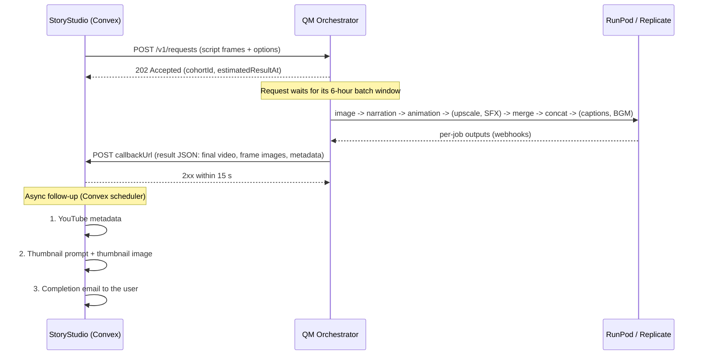

# StoryStudio ↔ QM Orchestrator: Video Generation Integration

**Date:** 2026-09-15
**Audience:** StoryStudio (storystudio-unified / Convex) developers
**Orchestrator:** `https://orchestrator.ai-storystudio.com` (quartermaster repo, `orchestrator/`)

This document is the contract between StoryStudio and the QM Orchestrator for background video
generation. It covers what StoryStudio sends, when the work runs, what the orchestrator sends back,
and what StoryStudio must do once the video arrives.

---

## 1. The flow at a glance



1. StoryStudio submits one request per project.
2. The orchestrator validates it immediately and acknowledges it. Validation errors come back
   synchronously, so a bad request fails in seconds, not hours later.
3. The project joins the current **6-hour batch** and is generated with the other projects in
   that batch (section 3).
4. When the project finishes (or fails), the orchestrator POSTs the **result JSON** to the
   project's `callbackUrl` (section 5).
5. StoryStudio acknowledges the callback, then generates YouTube metadata, the thumbnail prompt
   and image, and emails the user (section 6).

---

## 2. Submitting a project: `POST /v1/requests`

### 2.1 Endpoint and auth

```
POST https://orchestrator.ai-storystudio.com/v1/requests
Authorization: Bearer <ORCH_INGEST_TOKEN>
Content-Type: application/json
```

`ORCH_INGEST_TOKEN` is shared out of band. Store it as a Convex environment variable, never in
client code.

### 2.2 Request body

```json
{
  "requestId": "req_k57c9x2m_20260915T1012",
  "projectId": "k57c9x2m8f3q0r1t6y4w",
  "source": "mcp",
  "tier": "narration-premium",
  "product": "documentary",
  "language": "en",
  "aspectRatio": "16:9",
  "resolution": "1920x1080",
  "callbackUrl": "https://<convex-deployment>.convex.site/api/qm/result",

  "options": {
    "referenceImage": true,
    "voiceEngine": "qwen",
    "upscale": true,
    "upscaleEngine": "dreamx",
    "sfx": false,
    "removeSilence": true,
    "burnCaptions": true,
    "bgm": true,
    "qualityGates": "full",
    "promptHarness": "lint"
  },

  "cloneArtifactUrl": "https://pub-….r2.dev/voices/narrator_warm_f.pt",
  "bgmPrompt": "gentle, curious orchestral underscore, no vocals",

  "frames": [
    {
      "frameId": "f01",
      "narration": "Maya had always been the quiet one in her Queens middle school.",
      "durationS": 5,
      "imagePrompt": "The girl from the reference image walking alone near the lockers of a crowded Queens middle school hallway, head down, backpack on, cool fluorescent light, photorealistic cinematic film still, 16:9",
      "motionPrompt": "static camera, she walks slowly toward the camera",
      "audioPrompt": "school hallway ambience, distant chatter, locker doors",
      "referenceImageUrl": "https://pub-….r2.dev/projects/k57c9x2m/reference.png"
    },
    {
      "frameId": "f02",
      "narration": "In class, she only felt at home inside her sketchbook.",
      "durationS": 5,
      "imagePrompt": "The girl from the reference image sitting at the back of a classroom by the window, sketching in a notebook, warm afternoon light, photorealistic cinematic film still, 16:9",
      "motionPrompt": "slow push in toward her as her pencil moves",
      "referenceImageUrl": "https://pub-….r2.dev/projects/k57c9x2m/reference.png"
    }
  ]
}
```

### 2.3 Top-level fields

Unknown fields are rejected (the schema is strict), so send only what's listed here.

| Field | Type | Required | Notes |
|---|---|---|---|
| `requestId` | string | yes | **Idempotency key.** Re-sending the same `requestId` returns the original acknowledgement and never plans twice. Use a new one per generation attempt. |
| `projectId` | string | yes | StoryStudio's Convex project id. Echoed back in the result. One project id can only be planned under one `requestId`. |
| `source` | `"mcp"` | yes | Literal value. |
| `tier` | string | yes | Free-form label, echoed back as sent (e.g. `narration-premium`, `narrationPremium`). The only value the orchestrator acts on: a tier containing `dialogue` adds the lip-sync step, which it doesn't support yet. |
| `product` | string | yes | e.g. `documentary`. Echoed back in the result metadata. |
| `language` | string | yes | e.g. `en`. |
| `aspectRatio` | string | yes | `16:9`, `9:16` or `1:1`. |
| `resolution` | string | yes | e.g. `1920x1080`. Informational; the delivered resolution is reported in the result (section 5). |
| `callbackUrl` | URL | yes | Where the result JSON is POSTed (section 5). |
| `options` | object | no | See 2.4. Every option has a default. |
| `frames` | array | yes | At least 1 frame (**at least 2 in practice**, see section 8). See 2.5. |
| `cloneArtifactUrl` | URL | no | Qwen3-TTS voice clone artifact (`.pt`) from the StoryStudio voice catalog. Used when `options.voiceEngine` is `"qwen"`; takes priority over the voice-design fields. |
| `voiceSpeaker`, `voiceInstruct`, `voiceLanguage` | string | no | Qwen3-TTS voice-design mode, used when `voiceEngine` is `"qwen"` and no `cloneArtifactUrl` is sent. |
| `bgmPrompt` | string | if `options.bgm` | Background-music description. Required whenever `bgm` is true. |

### 2.4 `options`

| Option | Default | Effect |
|---|---|---|
| `referenceImage` | `false` | `true`: each frame's image is an edit of `frames[].referenceImageUrl` (character consistency, Narration Premium). `false`: plain text-to-image. |
| `voiceEngine` | `"kokoro"` | `"qwen"` for Qwen3-TTS with a cloned or designed voice. With Kokoro the voice is currently fixed (see section 8). |
| `upscale` | `false` | Upscales the video. |
| `upscaleEngine` | `"dreamx"` | `dreamx`: per-frame upscale before merge (2.25×; 1856×1056 for 16:9). `realesrgan`: upscales the final concatenated video instead. |
| `sfx` | `false` | Per-frame sound effects and ambience (MMAudio), mixed under the narration. Driven by `frames[].audioPrompt`. The model weights are non-commercial (CC-BY-NC-4.0), which is why this is opt-in. |
| `removeSilence` | `false` | Trims dead air from each frame's clip before concatenation. |
| `burnCaptions` | `false` | Burns captions into the final video, timed from the script. The SRT file is also returned. |
| `bgm` | `false` | Generates background music from `bgmPrompt` and mixes it under the final video. |
| `qualityGates` | `"full"` | Automatic image and motion QA with rework. `image-only` skips the motion gate; `off` skips both. |
| `promptHarness` | `"lint"` | Prompt guardrails. `lint` records what the guardrails would change but sends your prompts unchanged; `enforce` sends the guardrail-compiled prompts; `off` disables it. Leave as `lint` unless told otherwise. |
| `subtitles`, `textOverlay`, `shorts` | off | Accepted but **not produced yet** (section 8). |

### 2.5 `frames[]`

One entry per scene, in playback order. Each frame becomes one image, one narration clip, and one
animated clip; the clips are joined in array order.

| Field | Type | Required | Notes |
|---|---|---|---|
| `frameId` | string | yes | Unique within the request. Echoed back per frame in the result. |
| `narration` | string | yes | Narration text for this frame. Also used for script-timed captions. |
| `durationS` | number | yes | Estimated duration. The actual clip length follows the generated narration audio, **clamped to 3–7 seconds** (section 8). |
| `imagePrompt` | string | yes | The still image to generate. |
| `motionPrompt` | string | no | How the still is animated: one camera move plus the subject's movement (see 2.6). |
| `audioPrompt` | string | no | SFX/ambience description, used when `options.sfx` is true. Without it, an ambience prompt is derived from `imagePrompt`. |
| `referenceImageUrl` | URL | if `options.referenceImage` | The character reference image. Required on **every** frame when `referenceImage` is true. |
| `shot` | object | no | Structured shot description for the prompt harness. Optional; the orchestrator derives one when absent. **Recommended** — see `storystudio-narration-premium-prompt-generation.md` for the schema and the LLM prompt that produces it. |
| `textManifest` | object | no | Accepted, not used yet. |

### 2.6 Prompt guidance

> The structured alternative to this section is `frames[].shot` — a shot contract that the harness
> compiles both prompts from, with these rules enforced rather than advised. See
> **`storystudio-narration-premium-prompt-generation.md`**.

The animation model (Wan 2.2, 4-step) animates a single still image. Failures from the first
production run came almost entirely from prompts it can't execute:

- **Count things explicitly:** "one glowing crystal", "one girl, alone in frame".
- **One camera move per frame, and a simple one.** Static and slow push-in are reliable. Tracking
  shots, crane/pedestal moves and orbits are not.
- **Describe direction on screen:** "walks toward the camera", "moves screen-left". Avoid "forward",
  "past her", "behind her".
- **Match the image to the motion.** If she walks away from the camera, the image must already show
  her from behind. The animation can't move the camera to the other side of the subject.
- **No appear/vanish/transform in one frame.** Show the midpoint instead ("half through the wall").
- **Public places:** say they're empty if nobody else should appear ("an empty platform, she is the
  only person there").
- **Never write "avoid …" / "no …" in a prompt.** Image models tend to render the nouns they're given.

### 2.7 Responses

**202 Accepted:**

```json
{
  "requestId": "req_k57c9x2m_20260915T1012",
  "accepted": true,
  "cohortId": "win_2026_09_15_06",
  "windowClosesAt": "2026-09-15T12:00:00.000Z",
  "estimatedRunMinutes": 48,
  "estimatedResultAt": "2026-09-15T11:00:00.000Z",
  "estimateBasis": "measured",
  "jobCount": 142,
  "cohortProjects": 1
}
```

Store `cohortId` and `estimatedResultAt` on the project so the UI can show "queued, expected by …".
`estimateBasis` is `default` when there are no timing measurements yet for these steps.

| Status | Meaning | What StoryStudio should do |
|---|---|---|
| `202` | Accepted | Mark the project `queued`. Wait for the callback. |
| `400` | Validation failed. Body: `{ "error": "...", "issues": [{ "path": [...], "message": "..." }] }` | Don't retry. Fix the payload; show the issue to an operator. |
| `401` | Wrong or missing token | Configuration error. Don't retry. |
| `5xx` | Orchestrator busy or down | Retry with backoff using the **same `requestId`** (safe: requests are idempotent). |

---

## 3. Batch processing: every 6 hours

Generation runs in **batches (cohorts) aligned to 6-hour UTC windows: 00:00, 06:00, 12:00 and
18:00**. A request belongs to the window it arrives in; its cohort id names the window's opening
hour (`win_2026_09_15_06` = the 06:00–12:00 UTC window). Batching lets the orchestrator scale GPU
workers up once per step for many projects and back to zero afterwards, instead of paying for
warm-up per project.

What this means for StoryStudio:

- **This is not a realtime path.** Tell users their video will be ready within hours, not minutes,
  and use `estimatedResultAt` from the acknowledgement for the UI.
- **Don't poll.** The result is pushed to `callbackUrl`. If no callback has arrived within ~6 hours
  of `estimatedResultAt`, flag the project for an operator.
- A project that misses a window because the previous batch is still running is picked up by the
  next one.

> **Current rollout status (2026-09-15).** The window scheduler that queues requests for the next
> batch boundary isn't live yet. Today a request **starts generating as soon as it is accepted**, and
> only **one batch runs at a time**: a request that arrives while another batch is running is
> rejected with a `5xx`. Until the scheduler ships, StoryStudio should submit one project, wait for
> its callback, then submit the next, and retry a `5xx` later with the same `requestId`. Code written
> against the batch contract above keeps working unchanged when the scheduler lands.

---

## 4. What gets generated

Per frame, in order:

1. **Image**: text-to-image, or an edit of the reference image (`referenceImage`).
2. **Narration**: Kokoro or Qwen3-TTS.
3. **Animation**: the image animated into a clip sized to the narration.
4. **Upscale** (`upscale` + `dreamx`): 2.25× (1856×1056 for 16:9).
5. **SFX** (`sfx`): ambience and effects for the clip.
6. **Merge**: narration (and SFX) mixed onto the clip.
7. **Remove silence** (`removeSilence`).

Then, per project:

8. **Concat**: all frames joined in `frames[]` order.
9. **Upscale** (`upscale` + `realesrgan`).
10. **Captions** (`burnCaptions`): script-timed, burned in; SRT returned.
11. **Background music** (`bgm`): generated from `bgmPrompt` and mixed under the video.

With `qualityGates: "full"`, every image and every animated clip is scored by a vision model. A
rejected asset is reworked (a corrected prompt, then a stronger model) up to two times. If it still
fails, it's accepted and flagged (`qualityFlagged` in the result) rather than blocking the video.

---

## 5. The result: callback to `callbackUrl`

### 5.1 Delivery

When the project finishes, successfully or not, the orchestrator POSTs the result:

```
POST <callbackUrl>
Content-Type: application/json
User-Agent: qm-orchestrator/1
X-QM-Request-Id: <requestId>
X-QM-Signature: sha256=<hex HMAC-SHA256(ORCH_CALLBACK_SECRET, raw request body)>
```

- **Respond `2xx` within 15 seconds.** Do the follow-up work (section 6) asynchronously, after
  responding.
- **Retries:** up to 8 attempts, with delays of 1 s, 4 s, 16 s, 64 s, 256 s, then 5 min (about
  16 minutes in total). Timeouts, network errors, `5xx`, `408`, `425` and `429` are retried. **Any
  other `4xx` is treated as a permanent rejection and not retried**, so only return `4xx` for a
  genuinely invalid callback (for example a bad signature).
- **Deliveries can repeat.** De-duplicate on `requestId`: if the project already has this result,
  return `200` and do nothing.
- **Signature:** when `X-QM-Signature` is present, verify it against the **raw body bytes** (not
  re-serialized JSON) with a constant-time comparison. The shared secret is exchanged out of band
  (Convex env `QM_CALLBACK_SECRET`). Signing is currently **off** on the orchestrator. Implement
  verification now so it can be switched on without a StoryStudio release, and reject unsigned
  callbacks once it is.

### 5.2 Result JSON

```json
{
  "requestId": "req_k57c9x2m_20260915T1012",
  "projectId": "k57c9x2m8f3q0r1t6y4w",
  "cohortId": "win_2026_09_15_06",
  "status": "completed",
  "createdAt": "2026-09-15T10:12:04.311Z",
  "finishedAt": "2026-09-15T11:03:48.902Z",

  "project": {
    "tier": "narration-premium",
    "product": "documentary",
    "language": "en",
    "aspectRatio": "16:9",
    "resolution": "1920x1080",
    "frameCount": 2,
    "options": { "referenceImage": true, "voiceEngine": "qwen", "upscale": true, "upscaleEngine": "dreamx", "sfx": false, "removeSilence": true, "burnCaptions": true, "bgm": true, "qualityGates": "full", "promptHarness": "lint", "subtitles": false, "textOverlay": false, "shorts": { "enabled": false } }
  },

  "assets": {
    "final": {
      "url": "https://pub-….r2.dev/storystudio/video/20260915110348_…_mix_bgm.mp4",
      "durationS": 10.06,
      "bytes": 18432211,
      "resolution": "1856x1056"
    },
    "frames": [
      {
        "index": 0,
        "frameId": "f01",
        "status": "completed",
        "qualityFlagged": false,
        "imageUrl": "https://pub-….r2.dev/storystudio/images/…_f01.png",
        "narrationAudioUrl": "https://pub-….r2.dev/storystudio/audio/…_f01.wav",
        "narrationDurationS": 4.62,
        "clipUrl": "https://pub-….r2.dev/storystudio/video/…_f01_upscale.mp4",
        "mergedClipUrl": "https://pub-….r2.dev/storystudio/video/…_f01_trim.mp4"
      },
      {
        "index": 1,
        "frameId": "f02",
        "status": "completed",
        "qualityFlagged": true,
        "imageUrl": "https://pub-….r2.dev/storystudio/images/…_f02.png",
        "narrationAudioUrl": "https://pub-….r2.dev/storystudio/audio/…_f02.wav",
        "narrationDurationS": 4.18,
        "clipUrl": "https://pub-….r2.dev/storystudio/video/…_f02_upscale.mp4",
        "mergedClipUrl": "https://pub-….r2.dev/storystudio/video/…_f02_trim.mp4"
      }
    ],
    "subtitles": { "url": "https://pub-….r2.dev/storystudio/captions/….srt", "burnedIn": true },
    "bgm": { "url": "https://pub-….r2.dev/storystudio/audio/…_bgm.mp3" },
    "shorts": []
  },

  "steps": [
    { "seq": 0, "name": "image-i2i", "total": 2, "completed": 2, "failed": 0, "warmMs": 118000, "runMs": 61000 },
    { "seq": 8, "name": "concat", "total": 1, "completed": 1, "failed": 0, "warmMs": null, "runMs": 11000 }
  ],
  "quality": { "gated": 4, "passedFirstAttempt": 3, "reworked": 1, "acceptedMarginal": 1, "escalatedRung": 0 },
  "metrics": { "queuedMs": 2100, "runMs": 3100000, "gpuCostUsd": 0.1921, "qualityCostUsd": 0.012, "warmCostUsd": null },
  "errors": []
}
```

(`steps` is abbreviated; the real array has one entry per step that ran.)

### 5.3 Field reference

**Top level**

| Field | Notes |
|---|---|
| `requestId`, `projectId`, `cohortId` | As submitted / acknowledged. Match the result to the project on `projectId`; de-duplicate on `requestId`. |
| `status` | `completed`: everything succeeded. `partial`: **a final video exists**, but at least one frame or step failed (for example a frame was dropped from the concat). `failed`: no final video. |
| `createdAt`, `finishedAt` | When the request was accepted and when the result was assembled (ISO 8601, UTC). |
| `project` | The submitted metadata echoed back: `tier`, `product`, `language`, `aspectRatio`, `resolution`, `frameCount`, `options` (with defaults applied). |

**`assets`**

| Field | Notes |
|---|---|
| `final` | The finished video, or `null` when `status` is `failed`. `url` is the MP4. `durationS`, `bytes` and `resolution` can each be `null` when not measured. |
| `frames[]` | One entry per requested frame, **in `frames[]` order**. |
| `frames[].status` | `completed` or `failed` for that frame's own generation steps. |
| `frames[].qualityFlagged` | `true` when QA still rejected an asset after its reworks, but it was used anyway. Worth surfacing for review. |
| `frames[].imageUrl` | The generated still. Use it for storyboard previews and as the thumbnail reference image (section 6). |
| `frames[].narrationAudioUrl`, `narrationDurationS` | The narration audio and its actual duration. |
| `frames[].clipUrl` | The animated clip without narration (the upscaled version when upscale ran). |
| `frames[].mergedClipUrl` | The clip with narration (and SFX) mixed in, silence-trimmed when `removeSilence` ran. |
| `subtitles` | Present when captions ran: the SRT `url`, and `burnedIn: true`. |
| `bgm` | Present when background music ran: the music track on its own. |
| `shorts` | Always `[]` for now. |

Any frame URL is `null` if the step that produces it didn't run or failed.

**Diagnostics**

| Field | Notes |
|---|---|
| `steps[]` | Per-step job counts and timings, for ops dashboards. |
| `quality` | QA counts: assets evaluated, passed first time, reworked, accepted after exhausting reworks, model-escalated. |
| `metrics` | `queuedMs`, `runMs`, and cost estimates in USD. Cost fields can be `null` (not measured). |
| `errors[]` | `{ frameId, step, agent, reason, triedRungs }` for each failed or unfinished job. Capped at 200 entries; `errorsTotal` gives the full count when capped. |

**Asset URLs** are public links on StoryStudio's own Cloudflare-hosted storage (`pub-….r2.dev` or
`storyaistudio.app`), never temporary provider links: outputs from third-party providers are re-hosted
before they're reported. StoryStudio can reference them directly or copy them elsewhere.

---

## 6. What StoryStudio does after the callback

The callback handler should only **verify, de-duplicate, store and schedule**, then return `200`.
Everything below runs asynchronously (for example via `ctx.scheduler.runAfter(0, …)`), so a slow
Claude or image call can never cause a callback timeout and a duplicate delivery.

### 6.1 Callback handler (`POST /api/qm/result`, Convex HTTP action)

1. Verify `X-QM-Signature` when present (section 5.1). Return `401` on a mismatch.
2. Parse the body. Look up the project by `projectId`.
3. If this `requestId` was already processed, return `200` and stop.
4. Store the result on the project: `status`, `assets.final.url`, `frames[].imageUrl`/`mergedClipUrl`,
   `subtitles`, `quality`, `errors`, `finishedAt`.
5. Set the project's generation status from `status`: `completed`/`partial` → ready,
   `failed` → failed.
6. Schedule the post-processing action below (skipped when `status` is `failed`).
7. Return `200`.

This route **does not exist yet** in `backend/convex/http.ts`; it's the StoryStudio work item for
this integration.

### 6.2 Post-processing action (only when a final video exists)

Run in this order. Each step should be retry-safe and should not block the email if it fails.

1. **YouTube metadata.** Call `youtubeMetadata.generateYouTubeMetadata`
   (`{ projectId, videoContext? }`). It loads the project's title and script and returns the
   title, description and tags. Save them to the project.
2. **Thumbnail prompt.** Call `thumbnailGeneration.generateThumbnailPrompts`
   (`{ projectId, userId, referenceImageUrl, videoTitle, videoScript, numberOfVariations }`).
   - `referenceImageUrl`: use `assets.frames[i].imageUrl` from the result. Pick the first
     `completed` frame whose `qualityFlagged` is `false`, falling back to `frames[0]`.
   - `videoTitle`: the title generated in step 1.
3. **Thumbnail image.** Call `thumbnailGeneration.generateThumbnailImage`
   (`{ projectId, userId, prompt, aspectRatio }`) with the prompt from step 2 and
   `aspectRatio` = `project.aspectRatio` from the result. Save it with `saveThumbnailImage` /
   `thumbnails.saveThumbnailUrl`.
4. **Completion email.** Send the user a completion email with the project link, the final video
   URL and the thumbnail (for example `emailService.sendJobCompletionEmail`, or a variant of
   `sendMovieGenerationCompleteEmail` that already takes `finalVideoUrl`, `thumbnailUrl` and
   `durationSeconds`). Send it even if steps 1–3 failed; just omit the missing pieces.
   - For `status: "partial"`, say the video is ready but some scenes may need review.
   - For `status: "failed"`, send a failure email instead and skip steps 1–3.
   - Record that the email was sent, so a repeated callback never emails the user twice.

---

## 7. Checklist for StoryStudio

- [ ] Convex env: `QM_ORCHESTRATOR_URL`, `QM_INGEST_TOKEN`, `QM_CALLBACK_SECRET`.
- [ ] Build the request from the project's scenes (section 2), with a new `requestId` per attempt.
- [ ] Handle `202` / `400` / `5xx`; store `cohortId` and `estimatedResultAt`.
- [ ] UI: a "queued for the next batch, expected by …" state (section 3).
- [ ] Callback route `POST /api/qm/result`: signature check, `requestId` de-duplication, store,
      schedule, return `200` fast (section 6.1).
- [ ] Post-processing action: YouTube metadata → thumbnail prompt → thumbnail image → email
      (section 6.2), idempotent per `requestId`.
- [ ] Alert an operator if no callback arrives within ~6 h of `estimatedResultAt`.
- [ ] During the current rollout: one project in flight at a time (section 3 note).

---

## 8. Current limitations (2026-09-15)

| Limitation | Impact / workaround |
|---|---|
| Window scheduler not live | Requests start immediately; one batch at a time; `5xx` while busy (section 3). |
| Frame clip length clamped to 3–7 s | Keep each frame's narration **under ~6 seconds**. Longer narration is cut at 7 s; split long lines into more frames. |
| Single-frame projects fail at concat | Send at least 2 frames. |
| Kokoro voice fixed | With `voiceEngine: "kokoro"` every project uses the same default voice. For a chosen voice, use `voiceEngine: "qwen"` with `cloneArtifactUrl`. |
| `subtitles` (standalone SRT), `textOverlay`, `shorts` | Accepted but not produced. Burned-in captions (`burnCaptions`) do return an SRT. `assets.shorts` is always `[]`. |
| Dialogue tiers | Lip-sync isn't supported by the orchestrator yet. Use `narration-*` tiers. |
| Background music too quiet | With `bgm: true` the music currently mixes in at roughly −48 dB, effectively inaudible. A fix is pending on the orchestrator side; `assets.bgm.url` still returns the standalone track. |
| `metrics.warmCostUsd` | Always `null` for now. |
| Callback signing | Off on the orchestrator today; enabled once StoryStudio verifies signatures. |
